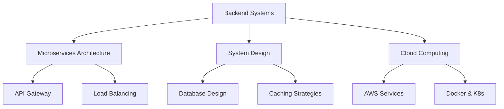

<div align="center">
  
</div>

<div align="center">
  
  [](https://github.com/tosinxt)
  [](https://github.com/tosinxt)
  
</div>

---


### 🚀 About Me

```yaml
name: Oluwatosin Alli
role: Backend Systems Engineer
age: 21
education: Final Year @ Babcock University (2020-2024)
location: Nigeria
interests: [Microservices, Scalability, FinTech, Open Source]
currently_learning: [Cloud Architecture, DevOps, System Design]
```

🔭 **Currently working on:** Scalable microservices architecture  
🌱 **Learning:** Advanced system design patterns and cloud technologies  
💬 **Ask me about:** Backend development, Node.js, MongoDB, system architecture  
⚡ **Fun fact:** Co-founder of ALiAS Hedge Fund & GDSC Backend Systems Member

---

## 🛠️ Tech Stack

<div align="center">

### Languages


### Backend & Database


### Frontend & Framework


### DevOps & Cloud


### Tools & Others


</div>

---

## 📊 GitHub Statistics

<div align="center">
  
  
</div>

<div align="center">
  
</div>

<div align="center">
  
</div>

---

## 🔥 Featured Projects

<div align="center">

[](https://github.com/tosinxt/smartvest)
[](https://github.com/tosinxt/memtest)

</div>

### 💼 Professional Projects

| Project | Description | Tech Stack | Status |
|---------|-------------|------------|--------|
| **🏦 ALiAS Hedge Fund** | Co-founded FinTech platform | Node.js, MongoDB, AWS | Active |
| **🎓 SafeKid Platform** | Child safety monitoring system | React, Express.js, PostgreSQL | Development |
| **📚 Scholx Backend** | Educational technology API | Node.js, MongoDB, Redis | Production |
| **💰 E-Commerce Platform** | Scalable microservices architecture | Node.js, Docker, AWS | Featured |

---

## 🎯 Current Focus



---

## 📈 Activity Graph

<div align="center">
  
</div>

---

## 🏆 Achievements & Certifications

- 🎓 **GDSC Backend Systems Member** - Google Developer Student Clubs
- 🏢 **Co-founder @ ALiAS Hedge Fund** - FinTech Startup
- 🎯 **Final Year Student @ Babcock University** - Computer Science (2020-2024)
- 💻 **Backend Systems Engineer** - Specializing in scalable architectures

---

## 📫 Let's Connect!

<div align="center">

[](https://tosinpy.vercel.app)
[](https://linkedin.com/in/oluwatosin-alli)
[](https://twitter.com/tosinxt)
[](mailto:your.email@example.com)
[](https://instagram.com/tosinxt)

</div>

---

## 💡 Random Dev Quote

<div align="center">
  


</div>

---

<div align="center">
  
### Show some ❤️ by starring some of my repositories!


</div>

---

<div align="center">
  
</div>

---

⭐️ **From [tosinxt](https://github.com/tosinxt)** with ❤️
