<!-- 🔥 EPIC COVER PHOTO SECTION 🔥 -->
<!-- Main Dynamic Header with Twinkling Animation -->
<div align="center">
  
</div>

<!-- Subtitle Professional Banner -->
<div align="center">
  
</div>

<!-- 🏆 MASSIVE BADGE COLLECTION 🏆 -->
<div align="center">
  
  ## 📊 Profile Stats & Badges
  
  <!-- GitHub Stats Badges -->
  
  
  
  
  
  <!-- Achievement Badges -->
  
  
  
  
  
  <!-- Professional Status Badges -->
  
  
  
  

</div>

<div align="center">
  
</div>

<div align="center">
  
  [](https://github.com/tosinxt)
  [](https://github.com/tosinxt)
  [](https://github.com/tosinxt)
  
</div>


### 🚀 About Me

 

```yaml
name: Tosin
full_name: Oluwatosin Alli
title: Lead Backend Developer @ Memora Hub
age: 22
birthday: November 20, 2002 🎂
current_education: Software Engineering @ Miva University (2024-Present) 
previous_education: Computer Science @ Babcock University (2020-2024) - Graduated
location: Nigeria 🇳🇬
expertise: [Legacy Systems, AI Integration, Microservices, System Architecture, FinTech]
currently_building: [Autodox - AI Code Documenter, Hustlrs - Nigeria's Biggest Tasking Marketplace]
achievements: [Built Memora Hub from scratch, Co-founded ALiAS Hedge Fund, Building Nigeria's largest tasking platform]
```

 **Currently working on:** Leading backend at Memora Hub, Building Autodox AI Code Documenter & Hustlrs Marketplace  
 **Learning:** Advanced AI/ML Integration, Large Scale System Design, DevOps & Cloud Architecture  
 **Ask me about:** Backend architecture, AI integration, legacy system migration, startup development, marketplace platforms  
 **Fun fact:** Building Nigeria's biggest tasking marketplace while documenting code with AI! 🤖


##  Tech Arsenal & Badges

<div align="center">

### 🎯 Skill Level Badges

<!-- Programming Languages with Skill Levels -->


###  Programming Languages


###  Backend & Infrastructure


###  AI/ML & Data Science


###  Database & Storage


###  Cloud & DevOps


###  Frontend & Mobile


### 🛠️ Tools & Platforms


### 🌐 Hosting & Deployment


### 📱 Social & Communication Badges
[](https://tosinpy.vercel.app)
[](https://linkedin.com/in/oluwatosin-alli)
[](https://twitter.com/tosinxt)
[](https://instagram.com/tosinxt)
[](https://discord.com/users/tosinxt)
[](https://t.me/tosinxt)
[](https://wa.me/your-number)
[](mailto:tosinalli.dev@gmail.com)

### 🎖️ Certification & Achievement Badges


### 💻 OS & Hardware Badges


### 📊 Dynamic GitHub Badges


</div>


##  GitHub Analytics

<div align="center">
  
  
</div>

<div align="center">
  
</div>

<div align="center">
  
</div>

<div align="center">
  
</div>


##  Current Projects

<div align="center">

[](https://github.com/tosinxt/autodox)
[](https://github.com/tosinxt/hustlrs)

</div>

<div align="center">

[](https://github.com/tosinxt/memora)
[](https://github.com/tosinxt/smartvest)

</div>

###  Professional Projects

<div align="center">

| Project | Role | Description | Tech Stack | Status | Impact |
|---------|------|-------------|------------|--------|---------|
| **🤖 Autodox** | Founder & Lead Developer | AI-powered code documenter that parses source code and generates documentation | Python, OpenAI, NLP, FastAPI | Active Development | Revolutionizing Documentation |
| **🇳🇬 Hustlrs** | Co-founder & CTO | Nigeria's biggest tasking marketplace platform | Node.js, React, PostgreSQL, Redis | Active Development | 50K+ Users Target |
| **🧠 Memora Hub** | Lead Backend Developer | Built entire legacy system from scratch - Memory enhancement platform | Node.js, MongoDB, Redis, AWS | Production | 10K+ Users |
| **🏦 ALiAS Hedge Fund** | Co-founder & CTO | FinTech platform for investment management | Node.js, PostgreSQL, Docker | Active | $500K+ Managed |
| **🎓 SafeKid Platform** | Backend Architect | Child safety monitoring system | Express.js, PostgreSQL, Socket.io | Development | 5K+ Families |
| **📚 Scholx Backend** | Senior Developer | Educational technology API platform | Node.js, MongoDB, GraphQL | Production | 50+ Schools |

```mermaid
graph TD
    A[🚀 Backend Systems] --> B[🔧 Microservices Architecture]
    A --> C[🏗️ System Design]
    A --> D[☁️ Cloud Computing]
    A --> E[🛡️ Security & Auth]
    A --> F[🤖 AI Integration]
    
    B --> G[API Gateway]
    B --> H[Load Balancing]
    B --> I[Service Mesh]
    
    C --> J[Database Design]
    C --> K[Caching Strategies]
    C --> L[Message Queues]
    
    D --> M[AWS Services]
    D --> N[Docker & K8s]
    D --> O[CI/CD Pipelines]
    
    E --> P[JWT & OAuth]
    E --> Q[Rate Limiting]
    E --> R[Data Encryption]
    
    F --> S[OpenAI Integration]
    F --> T[ML Model Deployment]
    F --> U[Natural Language Processing]
    
    style A fill:#ff9999
    style B fill:#66b3ff
    style C fill:#99ff99
    style D fill:#ffcc99
    style E fill:#ff99cc
    style F fill:#99ccff
```

</div>


##  AI & System Architecture Focus

<div align="center">



</div>


##  Live Metrics & Activity

<div align="center">
  
</div>

<div align="center">
  
  

</div>

<div align="center">
  
###  Real-time Coding Stats
  
  

</div>


##  Achievements & Recognition

<div align="center">

🎂 **Born November 20, 2002** - 22 years of building amazing things  
🤖 **Founder @ Autodox** - Revolutionizing code documentation with AI  
🇳🇬 **Co-founder @ Hustlrs** - Building Nigeria's biggest tasking marketplace  
🏆 **Lead Backend Developer @ Memora Hub** - Built entire legacy system from scratch  
🎓 **Software Engineering Student @ Miva University** - Currently pursuing advanced degree  
🏢 **Co-founder @ ALiAS Hedge Fund** - FinTech Startup revolutionizing investment  
💻 **GDSC Backend Systems Member** - Google Developer Student Clubs  
🌟 **AI Integration Specialist** - Specializing in AI-powered applications  
🚀 **Serial Entrepreneur** - Multiple successful tech ventures  

</div>

<div align="center">
  
</div>


##  Connect With Me

<div align="center">

[](https://tosinpy.vercel.app)
[](https://linkedin.com/in/oluwatosin-alli)
[](https://twitter.com/tosinxt)
[](mailto:tosinalli.dev@gmail.com)
[](https://instagram.com/tosinxt)
[](https://discord.com/users/tosinxt)
[](https://t.me/tosinxt)

</div>

<div align="center">
  
</div>


##  Random Dev Wisdom

<div align="center">
  


</div>


<div align="center">
  
###  Show some ❤️ by starring my repositories!


</div>

<div align="center">
  
</div>

<div align="center">
  
</div>

<div align="center">
  
⭐️ **From [Tosin](https://github.com/tosinxt)** - *Building the future with AI, one commit at a time* ⭐️

</div>
