<div align="center">
  
</div>

<div align="center">
  
</div>

<div align="center">
  
  [](https://github.com/tosinxt)
  [](https://github.com/tosinxt)
  [](https://github.com/tosinxt)
  
</div>


### 🚀 About Me

 

```yaml
name: Oluwatosin Alli
title: Lead Backend Developer @ Memora Hub
age: 21
current_education: Software Engineering @ Miva University (2024-Present) 
previous_education: Computer Science @ Babcock University (2020-2024) - Graduated
location: Nigeria 🇳🇬
expertise: [Legacy Systems, Microservices, System Architecture, FinTech]
currently_building: [Scalable Backend Systems, AI-Powered Apps, FinTech Solutions]
achievements: [Built Memora Hub from scratch, Co-founded ALiAS Hedge Fund]
```

 **Currently working on:** Leading backend development at Memora Hub & building legacy systems from scratch  
 **Learning:** Advanced Software Engineering patterns, Cloud Architecture, AI/ML Integration  
 **Ask me about:** Backend architecture, legacy system migration, startup development, FinTech  
 **Fun fact:** Built the entire Memora Hub backend infrastructure from the ground up!


##  Tech Arsenal

<div align="center">

###  Programming Languages


###  Backend & Infrastructure


###  Database & Storage


###  Cloud & DevOps


###  Frontend & Mobile


</div>


##  GitHub Analytics

<div align="center">
  
  
</div>

<div align="center">
  
</div>

<div align="center">
  
</div>

<div align="center">
  
</div>


##  Featured Projects

<div align="center">

[](https://github.com/tosinxt/memora)
[](https://github.com/tosinxt/smartvest)

</div>

###  Professional Projects

<div align="center">

| Project | Role | Description | Tech Stack | Status | Impact |
|---------|------|-------------|------------|--------|---------|
| **🧠 Memora Hub** | Lead Backend Developer | Built entire legacy system from scratch - Memory enhancement platform | Node.js, MongoDB, Redis, AWS | Production | 10K+ Users |
| **🏦 ALiAS Hedge Fund** | Co-founder & CTO | FinTech platform for investment management | Node.js, PostgreSQL, Docker | Active | $500K+ Managed |
| **🎓 SafeKid Platform** | Backend Architect | Child safety monitoring system | Express.js, PostgreSQL, Socket.io | Development | 5K+ Families |
| **📚 Scholx Backend** | Senior Developer | Educational technology API platform | Node.js, MongoDB, GraphQL | Production | 50+ Schools |
| **💰 E-Commerce Engine** | System Architect | Scalable microservices architecture | Docker, Kubernetes, AWS | Featured | 1M+ Requests/day |

```mermaid
graph TD
    A[🚀 Backend Systems] --> B[🔧 Microservices Architecture]
    A --> C[🏗️ System Design]
    A --> D[☁️ Cloud Computing]
    A --> E[🛡️ Security & Auth]
    
    B --> F[API Gateway]
    B --> G[Load Balancing]
    B --> H[Service Mesh]
    
    C --> I[Database Design]
    C --> J[Caching Strategies]
    C --> K[Message Queues]
    
    D --> L[AWS Services]
    D --> M[Docker & K8s]
    D --> N[CI/CD Pipelines]
    
    E --> O[JWT & OAuth]
    E --> P[Rate Limiting]
    E --> Q[Data Encryption]
    
    style A fill:#ff9999
    style B fill:#66b3ff
    style C fill:#99ff99
    style D fill:#ffcc99
    style E fill:#ff99cc
```

</div>


##  System Architecture Focus

<div align="center">



</div>


##  Live Metrics & Activity

<div align="center">
  
</div>

<div align="center">
  
  

</div>

<div align="center">
  
###  Real-time Coding Stats
  
  

</div>


##  Achievements & Recognition

<div align="center">

🏆 **Lead Backend Developer @ Memora Hub** - Built entire legacy system from scratch  
🎓 **Software Engineering Student @ Miva University** - Currently pursuing advanced degree  
🏢 **Co-founder @ ALiAS Hedge Fund** - FinTech Startup revolutionizing investment  
💻 **GDSC Backend Systems Member** - Google Developer Student Clubs  
🌟 **Legacy System Architect** - Specializing in scalable, maintainable architectures  
🚀 **Startup Technical Co-founder** - Multiple successful launches  

</div>

<div align="center">
  
</div>


##  Connect With Me

<div align="center">

[](https://tosinpy.vercel.app)
[](https://linkedin.com/in/oluwatosin-alli)
[](https://twitter.com/tosinxt)
[](mailto:tosinalli.dev@gmail.com)
[](https://instagram.com/tosinxt)
[](https://discord.com/users/tosinxt)
[](https://t.me/tosinxt)

</div>

<div align="center">
  
</div>


##  Random Dev Wisdom

<div align="center">
  


</div>


<div align="center">
  
###  Show some ❤️ by starring my repositories!


</div>

<div align="center">
  
</div>

<div align="center">
  
</div>

<div align="center">
  
⭐️ **From [tosinxt](https://github.com/tosinxt)** - *Building the future, one commit at a time* ⭐️

</div>
